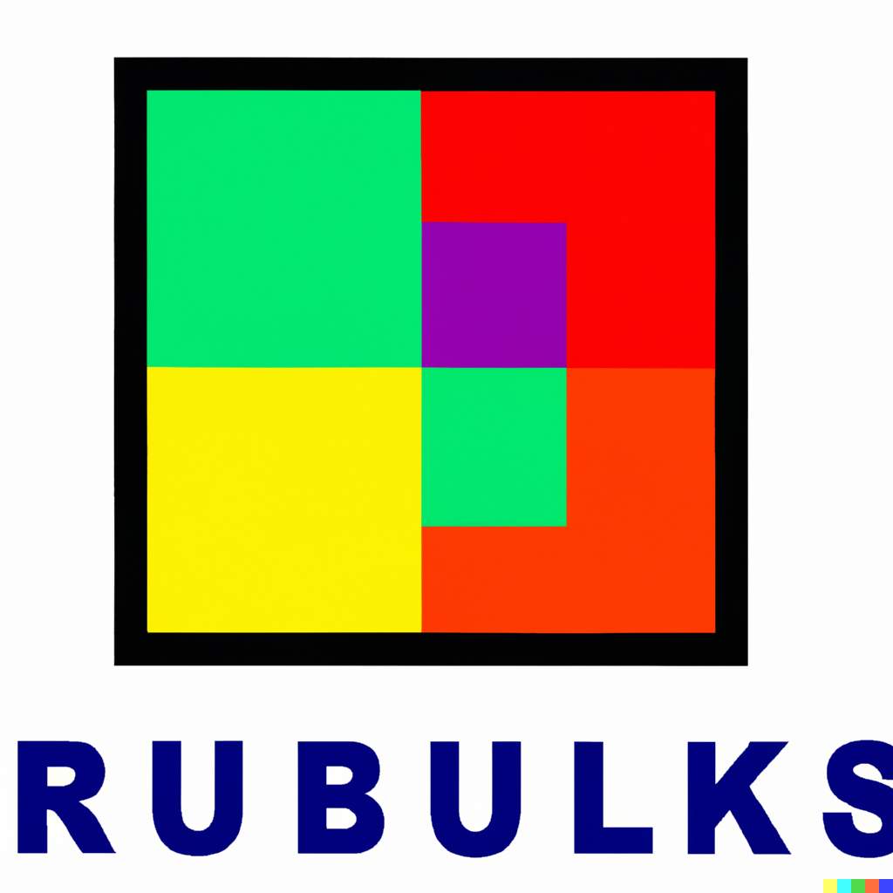
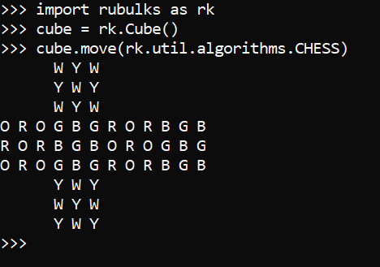

<!-- PROJECT SHIELDS -->
<!--
*** I'm using markdown "reference style" links for readability.
*** Reference links are enclosed in brackets [ ] instead of parentheses ( ).
*** See the bottom of this document for the declaration of the reference variables
*** for contributors-url, forks-url, etc. This is an optional, concise syntax you may use.
*** https://www.markdownguide.org/basic-syntax/#reference-style-links
-->

<!-- PROJECT LOGO -->
 

  
 
<i>
This unnecesary logo was automatically generated using DALL-E AI.
</i>

<h3 align="center">Rubulks</h3>
 

    This library generates 3x3x3 cubes and an interface to manipulate them programatically.
     
    <a href="https://github.com/rguitar96/rubulks/issues">Report Bug</a>
    ·
    <a href="https://github.com/rguitar96/rubulks/issues">Request Feature</a>
  

<!-- ABOUT THE PROJECT -->
## About The Project

I built this project as a fun challenge to come up with a data structure representation for the Rubik's Cube. The library allows you to generate cubes, move them around, and natively print its representation as an output. Some TODO stuff include implementing different solvings, adding more predefined algorithms, and more.

As a curiosity, when I asked DALL-E to generate an AI logo for the project, the name RUBULKS appeared after it, so I decided to keep it :)

Below, a simple cube instantiation is shown.

  

### Built With

<!-- LICENSE -->
## License

Distributed under the MIT License. See `LICENSE.txt` for more information.

<!-- CONTACT -->
## Contact

Rodrigo Pueblas - [@rguitar96](https://twitter.com/rguitar96) - rodrigo.pueblas@hotmail.com

Project Link: [https://github.com/rguitar96/rubulks](https://github.com/rguitar96/rubulks)

